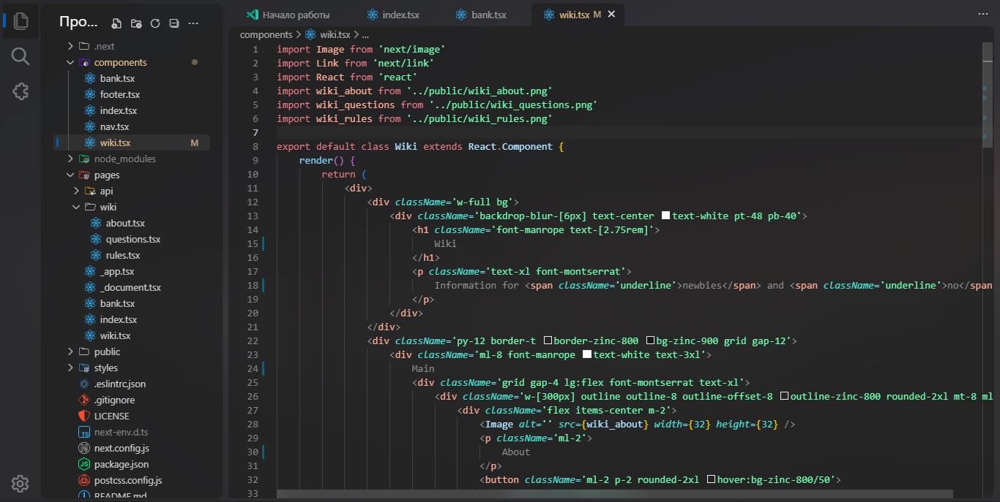
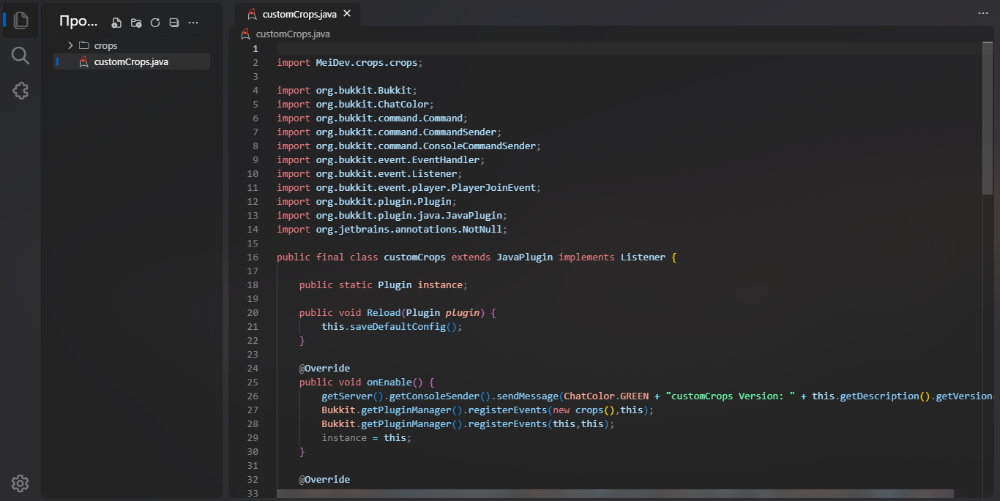

# Pastel 🌸
A Visual Studio Code theme for the pastel color fams. An ideal theme for everyday coding - the colors are neither bright nor dark, the theme matches perfectly with [Fluent UI](https://marketplace.visualstudio.com/items?itemName=leandro-rodrigues.fluent-ui-vscode)
# Images

